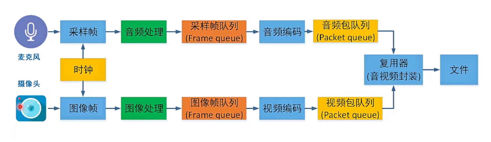
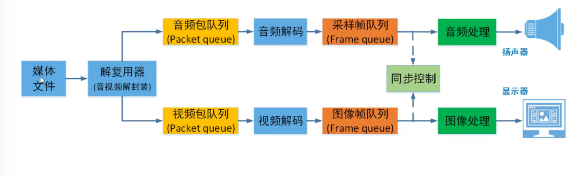
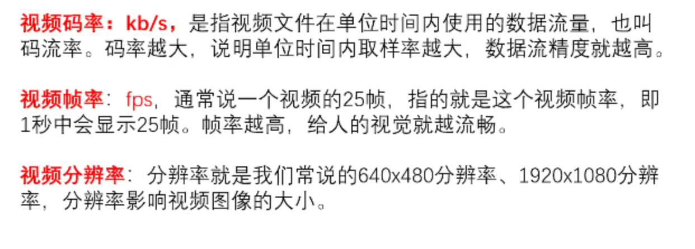

# 音视频开发

## 1. 音视频录制原理

采集 帧Frame图片 图像处理或音频处理（图片暗亮/音频PCM调节）44.1 k 采样点 数据做压缩

音频视频编码 压缩 在队列中读取数据 

时钟控制 播放等 共用一个时钟源 音视频同步问题

## 2. 音视频播放原理

 音频视频 分离 PCM 和视频文件 加队列  解码线程获取数据 放入帧的队列 进行 音频视频同步控制 进行处理等等 算法处理 图像亮度色彩 同步可以延后到音频处理完图像处理完。

## 3. 基础概念

1.pix 像素： picture + element， pixel。

2.分辨率：横向像素点乘以竖向像素点。 

| 清晰度 | 分辨率    |
| :----: | --------- |
|  360P  | 640*360   |
|  720P  | 1280*720  |
| 1080P  | 1920*1080 |
|   4K   | 3840*2160 |
|   8K   | 7680*4320 |

2 个1080P = 4K ，2个4K = 8K。小米15 Ultra ，相机16320×12288分辨率2亿像素，**理论值**：200,540,160像素 ≈ **2.005亿像素**。

一般情况下，图像的分辨率越高越清晰，但是光线等等也会对图片也有影响。

位深 红绿蓝 RGB Alpha。8Bit表示，256种颜色相乘就是1677万种颜色。

每个通道的位深越大 能够表示的颜色值就越大。

帧率 FPS 每秒多少帧画面。电影24fps 都按数据25fps   

码率 视频文件在单位时间内使用的数据流量。 如 1M bps ，100k bps ，200k bps，2000kbps，大多数情况下码率越高 分辨率越高，越清晰，但是有个情况是某些模糊视频的码率也会很高，（夜晚拍摄的视频等等）。码率和清晰度不是正比的呈现。

open  CV 可能需要的是 BGR排列。ARGB、RGBA、AGBR、BGRA需要注意格式。

YUV的含义；Y时亮度 UV 色度的分量/饱和度。 y是luma，uv：chroma，YUV电视的色彩的兼容。YUV具备很多的格式。

YUV的排列和采样方式造成它的格式众多。 YUV444。YUV放在一起就是打包模式或者平面模式。

YUV采样比例。 YUV 444 YUV 4:2:2 。4:2:0 。表示的是一个y分量对应的UV分量的比例。

444 和422 表示的是多少个Y才采一次UV。420 是采四个Y共用一组UV。

| YUV表示法 | 含义                                                         |
| :-------: | ------------------------------------------------------------ |
|    444    | 一个Y分量对应一个U分量对应一个V分量。色度频道没有下采样。    |
|    422    | 每2个Y分量共用一个U分量和一个V分量。即表示2:1的水平下采样没有垂直下采样。 |
|    420    | 每4个Y分量共用一个U分量和一个V分量。即表示2:1的水平下采样，2:1的垂直下采样。 |

YUV数据存储。三种格式。444级I444。YUV444P.YUV422P。YUV420P。I420.

RGB和YUV的格式转换。通常使用ffmpeg的swscale或者libyuv库的API转换。yuv的值大于255取255小于0取0

YUV的对齐问题。平面模式下的对齐。不能被16整除的时候需要扩充有些像内存对齐。

视频码率

视频帧率

视频分辨率

##### 1. I帧P帧B帧

##### 1.1 I帧 

什么是I帧？ I帧的全称是

I帧能够独立解码。

基础的概念

| 帧类型  | 全称                | 压缩原理                     | 解码依赖       | 典型占比 |
| ------- | ------------------- | ---------------------------- | -------------- | -------- |
| **I帧** | Intra-coded Frame   | 基于空间冗余独立压缩         | 无需参考其他帧 | 5-10%    |
| **P帧** | Predictive Frame    | 基于前向运动补偿预测         | 依赖前一I/P帧  | 30-40%   |
| **B帧** | Bi-predictive Frame | 双向运动补偿预测（前后参考） | 依赖前后I/P帧  | 50-60%   |

什么叫独立解码？不需要参考其他画面就可以自己解码。

