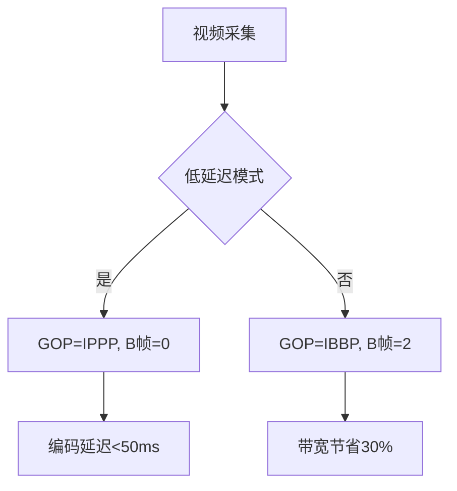

I帧P帧B帧


在视频编码中，I帧、P帧和B帧是三种关键帧类型，它们共同决定了视频的压缩效率和播放特性。以下从技术原理到应用场景的深度解析：

---

### **一、基础概念对比**
| 帧类型  | 全称                | 压缩原理                     | 解码依赖       | 典型占比 |
| ------- | ------------------- | ---------------------------- | -------------- | -------- |
| **I帧** | Intra-coded Frame   | 基于空间冗余独立压缩         | 无需参考其他帧 | 5-10%    |
| **P帧** | Predictive Frame    | 基于前向运动补偿预测         | 依赖前一I/P帧  | 30-40%   |
| **B帧** | Bi-predictive Frame | 双向运动补偿预测（前后参考） | 依赖前后I/P帧  | 50-60%   |

---

### **二、技术细节解析**
#### **1. I帧（关键帧）**
- **编码原理**：
  - 使用离散余弦变换（DCT）对8x8像素块进行频域转换
  - 量化后采用行程编码（RLE）和熵编码（如CAVLC/CABAC）
  - 典型压缩率：约1:7（相比原始YUV数据）
  
- **技术指标**：
  ```math
  \text{PSNR} \geq 40dB \quad (\text{在QP=18时})
  ```

#### **2. P帧（前向预测帧）**
- **运动补偿流程**：
  1. 宏块分割（16x16至4x4）
  2. 运动矢量搜索（全搜索/钻石搜索算法）
  3. 残差DCT变换
  4. 量化+熵编码
  
- **压缩效率**：
  ```math
  \text{比特率} \approx 0.3 \times \text{I帧比特率} 
  ```

#### **3. B帧（双向预测帧）**
- **预测模式**：
  - 前向预测（List0）
  - 后向预测（List1）
  - 双向加权平均

- **编码复杂度**：
  ```python
  # 典型复杂度对比（以H.264为例）
  I帧复杂度 = 1.0x
  P帧复杂度 = 2.5x 
  B帧复杂度 = 4.0x
  ```

---

### **三、GOP结构设计**
#### **典型GOP模式**：
```
IBBPBBPBBPBBPBB (16帧GOP)
```
- **关键参数**：
  - **GOP长度**：直播场景常用1秒（如30帧），点播场景可达10秒
  - **B帧数量**：蓝光编码常用连续3个B帧（IBBBP结构）

#### **延迟分析**：
| 编码配置         | 编码延迟 | 解码延迟 |
| ---------------- | -------- | -------- |
| 纯I帧            | 0帧      | 0帧      |
| IPPP结构         | 1帧      | 0帧      |
| IBBP结构（2B帧） | 3帧      | 2帧      |

---

### **四、实战优化策略**
#### **1. 直播场景配置**


#### **2. 存储优化方案**
- **B帧复用策略**：
  ```c
  // 解码器伪代码
  while (buffer.has_enough_frames()) {
      if (frame.is_B_frame()) {
          wait_for_reference_frames(); // 需要缓存前后参考帧
      }
      decode_frame();
  }
  ```
- **参考配置**：
  | 分辨率 | 推荐B帧数 | 量化参数(QP) |
  | ------ | --------- | ------------ |
  | 1080p  | 3         | 22-28        |
  | 4K     | 2         | 18-24        |

---

### **五、编解码器实现差异**
#### **H.264 vs H.265**：
| 特性        | H.264          | H.265 (HEVC)       |
| ----------- | -------------- | ------------------ |
| B帧参考范围 | 前后各1帧      | 前后最多4帧        |
| 加权预测    | 仅支持显式权重 | 支持隐式权重推导   |
| 并行处理    | 基于Slice      | 基于Tile/Wavefront |

#### **AV1创新**：
- **复合预测**：允许B帧参考多个时间层的帧
- **全局运动补偿**：提升大范围运动预测精度

---

### **六、故障排查指南**
#### **常见问题**：
1. **马赛克现象**：
   - 原因：I帧丢失导致P/B帧解码失败
   - 解决方案：增加I帧刷新频率（GOP长度减半）

2. **播放卡顿**：
   - 检查B帧缓冲设置：`ffplay -flags2 +chunky_threads`

3. **编码速度慢**：
   - 调整B帧搜索范围：`x264 --b-adapt 0`

---

通过合理配置I/P/B帧的比例和结构，可以在压缩率、画质、延迟之间实现最佳平衡。例如YouTube点播视频常用`IBBPBBPBBPBB`结构，而Zoom视频会议则采用纯IPPP结构以最小化延迟。理解这些帧类型的底层原理，是优化视频系统性能的关键。